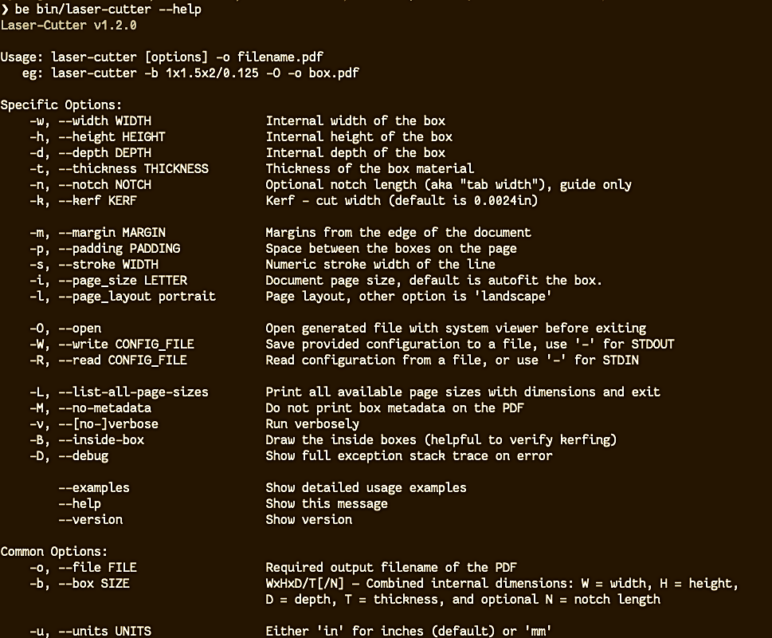

= LaserCutter

:toc:
:toclevels: 4
:sectnums:
:icons: font

image:https://badge.fury.io/rb/laser-cutter.svg[Gem Version,link=http://badge.fury.io/rb/laser-cutter,width="200"]

image:https://codecov.io/gh/kigster/laser-cutter/branch/master/graph/badge.svg?token=UjK2zCkrpH[Coverage,link=https://codecov.io/gh/kigster/laser-cutter,width="200"]

image::https://codecov.io/gh/kigster/laser-cutter/branch/master/graphs/icicle.svg?token=UjK2zCkrpH[Coverage Map]

== LaserCutter and Make-A-Box.io

`laser-cutter` is a ruby library for generating PDF designs for boxes of
custom dimensions that suit your project, that can be cut from wood or acrylic
using a laser-cutter. The sides of the box snap together using alternating notches,
that are deliberately layed out in a symmetric form.

To use `laser-cutter` you need to have a recent version of ruby interpreter,
install it as a gem, and use command line to generate PDFs.

NOTE: http://makeabox.io[Make-A-Box] is a online web application that uses `laser-cutter` library
and provides a straight-forward user interface for generating PDF designs without the need to install
the gem or use command line.

Use whatever suites you better.

=== Design Goals

One of the design goals of this project is to provide a highly extensible platform for creating
laser-cut designs, where alternative strategies can be added over time, and supported by various
command line options, and perhaps a light weight web application.  If you are interested in
contributing to the project, please see xref:CONTRIBUTING.adoc[contributing] for more details.

`laser-cutter` supports many flexible command line options that allow setting dimensions,
stroke width, page size, layout, margins, padding (spacing between the boxes), and many more.

== Dependencies

The gem depends primarily on http://prawnpdf.org[Prawn] -- a fantastic PDF generation library.

== Installation

Add this line to your application's Gemfile:

 gem 'laser-cutter'

And then execute:

 $ bundle

Or install it yourself as:

 $ gem install laser-cutter

== Usage

=== Examples

Create a box defined in inches, with kerf (cut width) set to 0.008", and open PDF in preview right after:

[source,bash]
----
laser-cutter -b 3x2x2/0.125 -k 0.008 -O -o box.pdf
----

Create a box defined in millimeters, print verbose info, and set
page size to A3, and layout to landscape, and stroke width to 1/2mm:

[source,bash]
----
laser-cutter -u mm -w70 -h20 -d50 -t4.3 -n5 -iA3 -l landscape -s0.5 -v -O -o box.pdf
----

List all possible page sizes in metric system:

[source,bash]
----
laser-cutter -L -u mm
----

Create a box with provided dimensions, and save the config to a file for later use:

[source,bash]
----
laser-cutter -b 1.1x2.5x1.5/0.125/0.125 -p 0.1 -O -o box.pdf -W box-settings.json
----

Read settings from a previously saved file:

[source,bash]
----
laser-cutter -O -o box.pdf -R box-settings.json
cat box-settings.json | laser-cutter -O -o box.pdf -R -
----

== Feature Wish List

* Create T-style joins, using various standard sizes of nuts and bolts (such as common #4-40 and M2 sizes)
* Extensibility with various layout strategies, notch drawing strategies, basically plug and play
model for adding new algorithms for path creation and box joining
* Support more shapes than just box, such as prisms
* Supporting lids and front panels, that are larger than the box itself and have holes for notches.
* Your brilliant idea can be here too!  Please see xref:CONTRIBUTING.adoc[contributing] for more info.

== LaserCutter vs BoxMaker

https://github.com/rahulbot/[Rahulbot]-made https://github.com/rahulbot/boxmaker/[BoxMaker] is a
functional generator of notched designs, similar to `laser-cutter`, and generously open sourced
by the author, and so in no way this project disputes BoxMaker's viability. In fact BoxMaker was an
inspiration for this project.

Laser-Cutter library attempts to further advance the concept of programmatically creating
laser-cut box designs, provides additional fine tuning, many more options, strategies and most
importantly -- extensibility.

Unlike `BoxMaker`, this gem has a suit of automated tests (rspecs) around the core functionality.
In addition, new feature contributions are highly encouraged, and in that
regard having existing test suit offers confidence against regressions, and thus welcomes colaboration.

Finally, BoxMaker's notch-drawing algorithm generates non-symmetric and sometimes purely broken designs
(see picture below).

``laser-cutter``'s algorithm will create a _symmetric design for most panels_, but it might sacrifice
identical notch length. Depending on the box dimensions you may end up with a slightly different notch
length on each side of the box.

The choice ultimately comes down to the preference and feature set, so here I show you two boxes made with
each program, so you can pick what you prefer.

=== Example Outputs

Below are two examples of boxes with identical dimensions produced with `laser-cutter` and `boxmaker`:

This is how you would make a box with Adam Phelp's fork of BoxMaker (which adds flags and a lot of
niceties):

[source,bash]
----
git clone https://github.com/aphelps/boxmaker && cd boxmaker && ant
java -cp BOX.jar com.rahulbotics.boxmaker.BoxMaker \
      -W 1 -H 2 -D 1.5 -T 0.125 -n 0.125 -o box.pdf
----

And laser-cutter:

[source,bash]
----
gem install laser-cutter
laser-cutter -b 1x1.5x2/0.125/0.125 -O -o box.pdf
----

image:doc/comparison.jpg[LaserCutter Comparison].

== Contributing

. Fork it ( https://github.com/[my-github-username]/laser-cutter/fork )
. Create your feature branch (`git checkout -b my-new-feature`)
. Commit your changes (`git commit -am 'Add some feature'`)
. Push to the branch (`git push origin my-new-feature`)
. Create a new Pull Request
