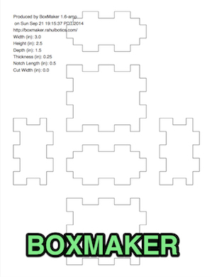

[](http://badge.fury.io/rb/laser-cutter)
[](http://travis-ci.org/kigster/laser-cutter)
[](https://codeclimate.com/github/kigster/laser-cutter)
[](https://codeclimate.com/github/kigster/laser-cutter)

## LaserCutter

Similar to [BoxMaker](https://github.com/rahulbot/boxmaker/) (which is written in Java a long time ago), 
this ruby gem generates PDFs that can be used as a basis for cutting boxes on a typical laser cutter. 

Unlike ```BoxMaker```, this gem has a lot of automated tests around creating the geometry of the notches
and calculating locations. This welcomes additional feature contributions from other developers,
as existing test suite offers confidence around not introducing bugs or regressions.

BoxMaker's algorithm _ensures that the same notch length is across all sides, but sacrifices
symmetry as a result_.  So you may have a front panel's left and right edges be simply non symmetric. 
And that might be entirely OK with you :)
 
```laser-cutter```'s algorithm will create a _symmetric design for most panels_, but it might sacrifice
identical notch length. Depending on the box dimensions you may end up with a slightly different notch 
length on each side of the box.

Having said that, one of the design goals of this ruby version is to provide a highly extensible platform,
where alternative algorithms can be implemented and supported by command line options.

```laser-cutter``` has quite a few options that allow you to set stroke width, page size,
layout, margins, padding (spacing between boxes), open the PDF file using system viewer right
after generation, and many more are coming soon.

The choice ultimately comes down to the preference and feature set, so here I show you two boxes made with
each program, so you can pick what you prefer. 

#### Disclaimer

Important quick note that the author believes that BoxMaker is a greatly useful piece of software 
generously open sourced by the author, and so in no way this project disputes it's viability.  
In fact BoxMaker was an inspiration for this project. This project simply attempts to advance 
further and provide additional solutions to this complex problem of creating 3D designs on a 2D
surface using laser cutter.

### Example Outputs

Below are two examples of boxes with identical dimensions produced with ```laser-cutter``` and ```boxmaker```:

#### BoxMaker 

```bash
git clone https://github.com/rahulbot/boxmaker.git && cd boxmaker
ant
java -cp BOX.jar com.rahulbotics.boxmaker.BoxMaker \
      -i -W 2.5 -H 2 -D 1 -T 0.25 -n 0.5 -f file.pdf
```

.

#### LaserCutter 

```bash
gem install laser-cutter
laser-cutter -u in -s 2.5x1x2/0.25/0.5 -o file.pdf
```

.

## Future Features

* Creating T-style joins, using various sized nuts and bolts (such as common #4-40 and M2 sizes)
* Creating lids and front panels that are larger than the box 
* Rendering to CSS to show live preview on a web app
* Your brilliant idea can be here!  Please see [contributing](CONTRIBUTING.md) for more info.

## Installation

Add this line to your application's Gemfile:

    gem 'laser-cutter'

And then execute:

    $ bundle

Or install it yourself as:

    $ gem install laser-cutter

## Usage

```bash
Usage: laser-cutter [options]
       laser-cutter --list-all-page-sizes --units in

Examples:
  1. Create a box defined in inches, and open PDF in preview right after:

       laser-cutter --units in -s 3x2x2/0.125/0.5  -O -o box.pdf

  2. Create a box defined in millimeters, print verbose info and set
     page size to A3, and layout to landscape, and stroke width to 2mm:

       laser-cutter -w70 -h20 -d50 -t4.3 -n5 -PA3 -L landscape -S 0.5 -v -O -o box.pdf


Specific options:
    -s, --size WxHxD/T/N             Combined internal dimensions: W = width, H = height,
                                     D = depth, T = thickness, N = notch length

    -w, --width WIDTH                Internal width of the box
    -h, --height HEIGHT              Internal height of the box
    -d, --depth DEPTH                Internal depth of the box
    -t, --thickness THICKNESS        Thickness of the box material
    -n, --notch NOTCH                Preferred notch length (used only as a guide)
    -o, --file FILE                  Output filename of the PDF
    -u, --units UNITS                Either 'mm' (default) or 'in'
    -m, --margin MARGIN              Margins from the edge of the document
    -p, --padding PADDING            Space between the boxes on the page
    -P, --page_size LETTER           Page size, see --list-all-page-sizes for more info.
    -L, --page_layout portrait       Page layout, other option is 'landscape'
    -S, --stroke WIDTH               Numeric stroke width of the line
    -O, --open                       Open generated file with system viewer before exiting
    -A, --list-all-page-sizes        Print all available page sizes with dimensions and exit
    -v, --[no-]verbose               Run verbosely

Common options:
        --help                       Show this message
        --version                    Show version
```       

## Contributing

1. Fork it ( https://github.com/[my-github-username]/laser-cutter/fork )
2. Create your feature branch (`git checkout -b my-new-feature`)
3. Commit your changes (`git commit -am 'Add some feature'`)
4. Push to the branch (`git push origin my-new-feature`)
5. Create a new Pull Request
