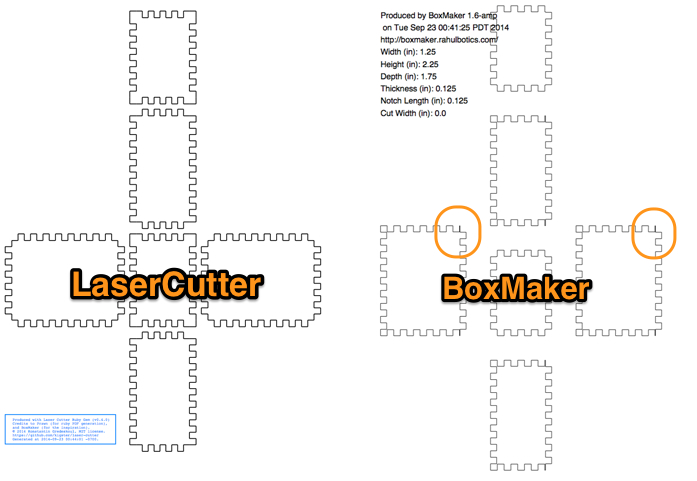

[](http://badge.fury.io/rb/laser-cutter) 

## LaserCutter and Make-A-Box.io

`laser-cutter` is a ruby library for generating PDF designs for boxes of custom dimensions that suit your project, that can be cut from wood or acrylic using a laser-cutter. The sides of the box snap together using alternating notches, that are deliberately layed out in a symmetric form.

To use `laser-cutter` you need to have a recent version of ruby interpreter, install it as a gem, and use command line to generate PDFs.

[Make-A-Box](http://makeabox.io) is a online web application that uses `laser-cutter` library and provides a straight-forward user interface for generating PDF designs without the need to install the gem or use command line.

Use whatever suites you better.

### Design Goals

One of the design goals of this project is to provide a highly extensible platform for creating laser-cut designs, where alternative strategies can be added over time, and supported by various command line options, and perhaps a light weight web application. If you are interested in contributing to the project, please see [contributing](CONTRIBUTING.md) for more details.

`laser-cutter` supports many flexible command line options that allow setting dimensions, stroke width, page size, layout, margins, padding (spacing between the boxes), and many more.

## Dependencies

The gem depends primarily on [Prawn](http://prawnpdf.org) – a fantastic PDF generation library. SVG output uses [Victor](https://github.com/DannyBen/victor), and the command line is built on [dry-cli](https://dry-cli.tools/). It needs Ruby 4.0 or newer.

## Installation

Add this line to your application's Gemfile:

```
gem 'laser-cutter'
```

And then execute:

```
$ bundle
```

Or install it yourself as:

```
$ gem install laser-cutter
```

## Usage

```text
laser-cutter COMMAND [OPTIONS]

  generate, g    Draw the panels of a box into a PDF or an SVG file
  page-sizes     List every page size, with its dimensions
  examples       Show detailed usage examples
  help           Show help, for the program or for one command
  version        Print the version
  completion     Print a bash or zsh completion script
```

`laser-cutter help generate` lists every option. The common ones:

| Option                 | Meaning                                                        |
| :--------------------- | :------------------------------------------------------------- |
| `-b`, `--box`          | `WxHxD/T[/N]`: width, height, depth, thickness, optional notch |
| `-w`, `-H`, `-d`, `-t` | Width, height, depth and thickness, one at a time              |
| `-n`, `--notch`        | Notch length, a guide only                                     |
| `-k`, `--kerf`         | Kerf, the width of the cut                                     |
| `-L`, `--lid`          | `full` (default), `back` or `plain`, see below                 |
| `-u`, `--units`        | `in` (default) or `mm`                                         |
| `-o`, `--file`         | File to write, required                                        |
| `-f`, `--format`       | `pdf` (default) or `svg`, in either case                       |
| `-B`, `--inside-box`   | Also draw the box without kerf, in red                         |
| `-W`, `-R`             | Save the configuration to a file, or read it from one          |

Height is `-H`, because `-h` prints help.

### Examples

A box in inches, with the kerf set to 0.008", opened once it is written:

```bash
laser-cutter generate -b 3x2x2/0.125 -k 0.008 -O -o box.pdf
```

A box with a lid that lifts off:

```bash
laser-cutter generate -b 3x2x2/0.125 --lid plain -o box.pdf
```

### The lid

The lid is the top panel. `--lid` sets how it joins the walls:

| `--lid` | The lid                              | The walls under it                                |
| :------ | :----------------------------------- | :------------------------------------------------ |
| `full`  | Notched on all four sides            | Notched; the box is glued shut                    |
| `back`  | Notched where it meets the back wall | The back is notched, the other three are straight |
| `plain` | A rectangle, no notches              | All four are straight                             |

A lid edge without notches reaches the outside of the wall under it, and that wall ends at the internal height. So a `plain` lid is `W + 2T` by `D + 2T` and lies on top of the box, and the space inside is still `W` by `H` by `D`.

The same box as an SVG:

```bash
laser-cutter generate -b 3x2x2/0.125 -f svg -o box.svg
```

A box in millimeters on a landscape A3 page, with a 0.5mm stroke:

```bash
laser-cutter generate -u mm -w 70 -H 20 -d 50 -t 4.3 -n 5 -i A3 -l landscape -s 0.5 -o box.pdf
```

Every page size, in millimeters:

```bash
laser-cutter page-sizes -u mm
```

Save the settings of a box, and use them again:

```bash
laser-cutter generate -b 1.1x2.5x1.5/0.125/0.125 -p 0.1 -o box.pdf -W box-settings.json
laser-cutter generate -o box.pdf -R box-settings.json
cat box-settings.json | laser-cutter generate -o box.pdf -R -
```

## Using it from Ruby

A Ruby program draws a box in its own process; nothing runs the command line. It needs three things:

| Call                            | What it does                                      |
| :------------------------------ | :------------------------------------------------ |
| `Laser::Cutter::Options.new`    | Every setting of a box, typed and checked         |
| `Laser::Cutter.render(options)` | Returns the PDF or the SVG as a String            |
| `Laser::Cutter.write(options)`  | Writes it to `options.file`, and returns the path |

```ruby
require "laser-cutter"

options = Laser::Cutter::Options.new(
  width: 70, height: 20, depth: 50, thickness: 4.3,
  units: :mm, lid: :plain, format: :svg
)

svg = Laser::Cutter.render(options)                      # a String, no file written
Laser::Cutter.write(options.new(file: "box.pdf", format: nil)) # the extension picks the format
```

`Options` has an attribute for each option of `generate`:

| Attribute                               | Type                    | When left out                  |
| :-------------------------------------- | :---------------------- | :----------------------------- |
| `width`, `height`, `depth`, `thickness` | Float above zero        | `MissingOption` is raised      |
| `notch`                                 | Float above zero        | Three times the thickness      |
| `kerf`, `margin`, `padding`             | Float, zero or more     | The default for the units      |
| `stroke`                                | Float above zero        | The default for the units      |
| `units`                                 | `in` or `mm`            | `in`                           |
| `lid`                                   | `full`, `back`, `plain` | `full`                         |
| `format`                                | `pdf` or `svg`          | `pdf`, or the file's extension |
| `file`                                  | String                  | Only `write` needs it          |
| `page_size`                             | A name such as `A4`     | The page fits the box          |
| `page_layout`                           | `portrait`, `landscape` | `portrait`                     |
| `metadata`                              | Boolean                 | `true`                         |
| `inside_box`                            | Boolean                 | `false`                        |

- Values are coerced, so the Strings a web form sends will do, and a blank String counts as left out. Keys may be Strings or Symbols.
- A value it cannot use, or a key that is not an option, raises `Laser::Cutter::InvalidOption` with a message such as `lid cannot be "sliding", but must be one of: full, back, plain.` Both errors descend from `Laser::Cutter::Error`.
- An `Options` cannot be changed; `options.new(lid: :back)` returns a changed copy.

In a Rails controller:

```ruby
def create
  box = params.require(:box).permit(*Laser::Cutter::Options.attribute_names)
  send_data Laser::Cutter.render(box.to_h), type: "application/pdf", filename: "box.pdf"
rescue Laser::Cutter::Error => e
  redirect_to new_box_path, alert: e.message
end
```

`Laser::Cutter::Box::LIDS` lists the lids, for a select. `Configuration`, `Renderer::LayoutRenderer#render` and `PageManager#page_size_values`, which MakeABox.io called in 1.0.3, still work.

## Feature Wish List

- Create T-style joins, using various standard sizes of nuts and bolts (such as common #4-40 and M2 sizes)
- Extensibility with various layout strategies, notch drawing strategies, basically plug and play model for adding new algorithms for path creation and box joining
- Support more shapes than just box, such as prisms
- Supporting lids and front panels, that are larger than the box itself and have holes for notches.
- Your brilliant idea can be here too! Please see [contributing](CONTRIBUTING.md) for more info.

## LaserCutter vs BoxMaker

[Rahulbot](https://github.com/rahulbot/)-made [BoxMaker](https://github.com/rahulbot/boxmaker/) is a functional generator of notched designs, similar to `laser-cutter`, and generously open sourced by the author, and so in no way this project disputes BoxMaker's viability. In fact BoxMaker was an inspiration for this project.

Laser-Cutter library attempts to further advance the concept of programmatically creating laser-cut box designs, provides additional fine tuning, many more options, strategies and most importantly – extensibility.

Unlike `BoxMaker`, this gem has a suit of automated tests (rspecs) around the core functionality. In addition, new feature contributions are highly encouraged, and in that regard having existing test suit offers confidence against regressions, and thus welcomes colaboration.

Finally, BoxMaker's notch-drawing algorithm generates non-symmetric and sometimes purely broken designs (see picture below).

`laser-cutter`'s algorithm will create a _symmetric design for most panels_, but it might sacrifice identical notch length. Depending on the box dimensions you may end up with a slightly different notch length on each side of the box.

The choice ultimately comes down to the preference and feature set, so here I show you two boxes made with each program, so you can pick what you prefer.

### Example Outputs

Below are two examples of boxes with identical dimensions produced with `laser-cutter` and `boxmaker`:

This is how you would make a box with Adam Phelp's fork of BoxMaker (which adds flags and a lot of niceties):

```bash
git clone https://github.com/aphelps/boxmaker && cd boxmaker && ant
java -cp BOX.jar com.rahulbotics.boxmaker.BoxMaker \
      -W 1 -H 2 -D 1.5 -T 0.125 -n 0.125 -o box.pdf
```

And laser-cutter:

```bash
gem install laser-cutter
laser-cutter generate -b 1x1.5x2/0.125/0.125 -O -o box.pdf
```

.

## Contributing

1. Fork it ( https://github.com/[my-github-username]/laser-cutter/fork )
1. Create your feature branch (`git checkout -b my-new-feature`)
1. Commit your changes (`git commit -am 'Add some feature'`)
1. Create a new Pull Request
1. Push to the branch (`git push origin my-new-feature`)

## License

MIT License (MIT). Please see [LICENSE](LICENSE) for more information.

Author: © 2015-2024 Konstantin Gredeskoul [@kigster](https://github.com/kigster)
